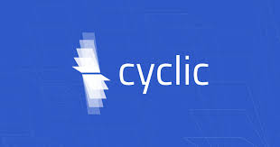

<h1 align="center">Hi 👋, I'm Hardika Moradiya</h1>
<h3 align="center">I'm a Front-end Developer living in Bielefeld, Germany</h3>

  

- 🌱 I’m currently learning **Node.js and backend development**

- 💬 Ask me about **react, redux, responsive web development**

- 📫 How to reach me **hardika.moradiya@web.de**

<h3 align="left">Connect with me:</h3>

<h3 align="left">Languages and Tools:</h3>

                   

  

